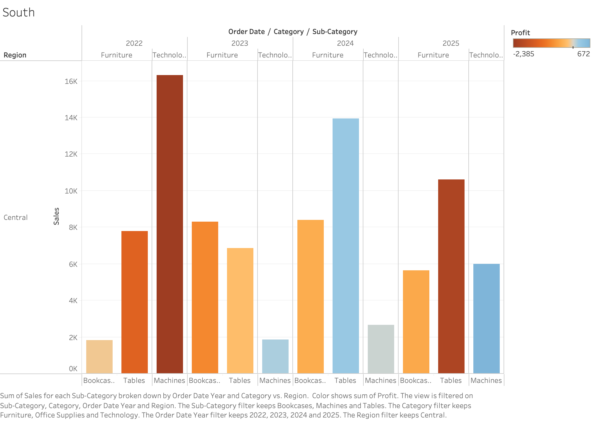
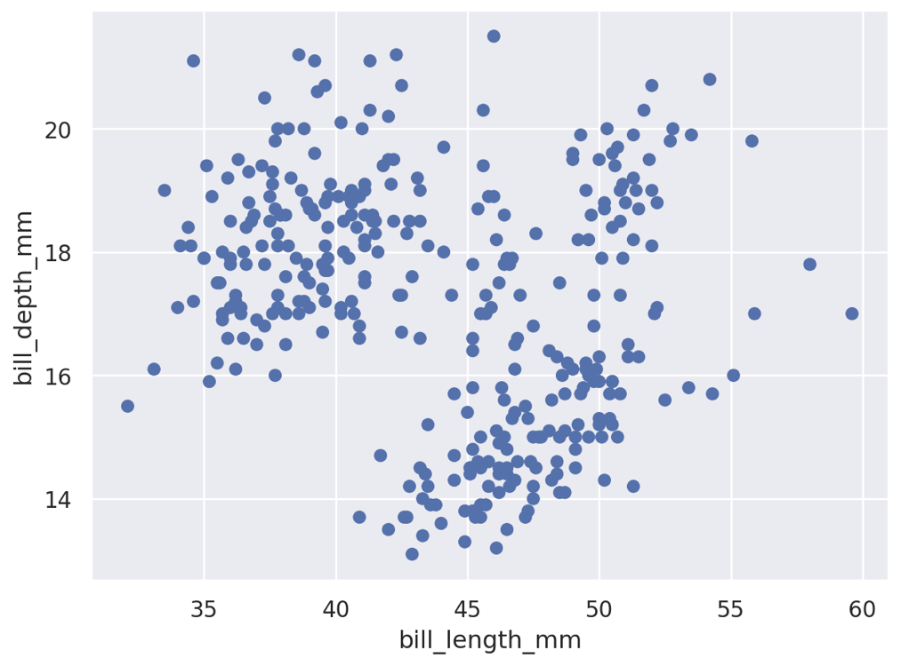
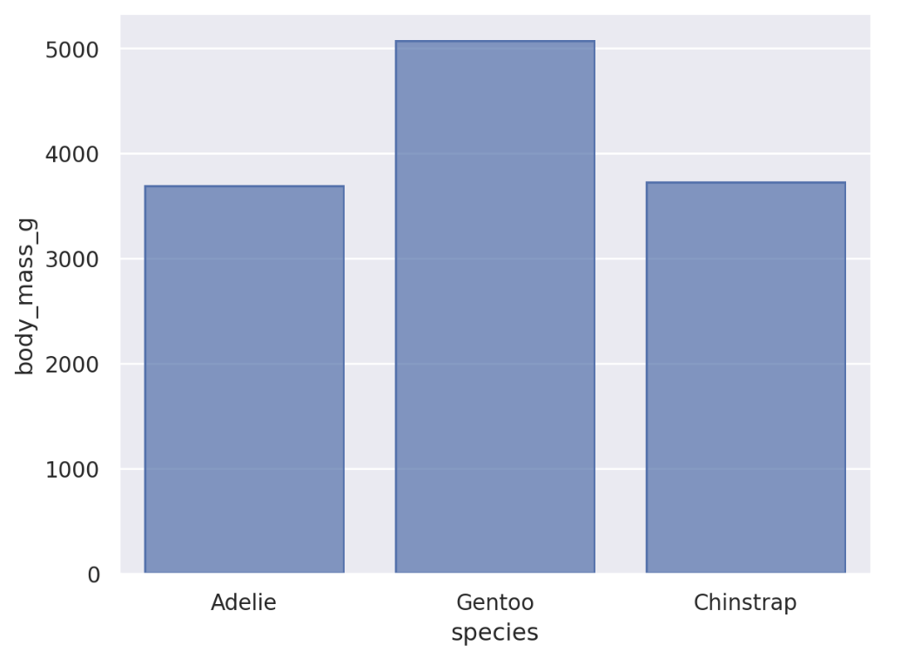

# Homework 1: Tool Setup

Laura Roman-Gonzalez  
CS 625, Fall 2025  
Due: September 7, 2025

## Git, GitHub

### Q1 - URL of GitHub Repo
The URL for the GitHub Repo is: https://github.com/LauraRomanGonzalez/CS625-Project-Files/tree/main.  
In this URL one should be able to find at least three different files, two of them were new create files (Test and Project) and an uploaded file (LCRG HW1-report.md).

### Q2 - Pull Command
Initially, I use the git clone command to download the entire repository from GitHub to my local computer. Once this is complete, I can use the git pull command to get the latest files from GitHub and update my local copy.
To pull files from GitHub to my local drive, I follow these steps:
1. Change directory: Navigate to the local repository folder using cd.
2. Pull updates: Run git pull to fetch and merge the latest changes from GitHub.
3. Verify files: Use ls to confirm which files were updated or added.

### Q3 - Local Commits

If a change one committed locally is not visible on GitHub.com, one of the following steps may have been missed:
- The add step, where the file is staged.
- The commit step, where the change is saved locally.  
- The push step, where the change is sent to GitHub.  
If one is certain the file was staged and committed, the most likely issue is that the push step was not completed successfully.

## Markdown

### Q1 - Bulleted List

- Blue
- Yellow
- Red  

*A bulleted list uses simple symbols (such as dots or dashes) to mark each item, while a numbered list uses sequential numbers. A numbered list often implies order or priority, whereas a bulleted list simply groups related items without implying sequence.*  

### Q2 - Markdown Paragraph

The next step is for me to add a picture of my dog **Sammy**. He is an *Australian sheperd*. He is 8 years old, and red merle. He travel from Mississipi to ***Virgina*** with me when he was adopted.

[Aussie Information](https://www.akc.org/dog-breeds/australian-shepherd/)

I will use an 'git pull' to pull the updated files with Sammy's picture back to my local drive.

### Q3 - Animal Image
### - Picture of my dog Sammy:  
I added a picture to my repository, and since I did not place it in a specific folder, I did not need to specify its location in the path. However, I used HTML to resize the picture to make it display appropriately in the report.

## Tableau

### Q1 - Region Other Than the South
After signing up for Tableau, I used the sample dataset Superstore.xlsx. By following the steps found online, I learned how to set up different graphs, starting with a line graph. As I filtered through the data and added more fields to the columns or rows, I observed how the visualizations changed. Later in the process, I customized elements such as color, which helped highlight insights in the data and prompted additional analysis by raising potential questions.

The following graph focuses on the Central region, showing that profits for Tables were highest in 2024 and 2025. The bar chart also demonstrates that profits for Machines have decreased compared to 2022. For a store, this could raise important questions:  
- Did they not sell enough machines?
- Were machine sales not profitable — meaning they may have sold many units, but at low profitability?
- Should the store continue selling machines at all?

## Google Colab

### Q1 - URL of Google Colab Notebook
To share my Google Colab notebook, I signed in to my ODU Gmail account. After signing in, I created a class folder in Google Drive, and within that folder, I added a Homework-1 subfolder for organizational purposes. I then saved my HW1-setup notebook in this folder. The shareable link I included in my HW1-report.md file is the one generated for this class folder named CS625.

[Colab Line CS625 Folder](https://drive.google.com/drive/folders/1dq20nE0cIIs1y-GNWwB0xK-Wj_bza9fW?usp=sharing)

## Python/Seaborn

### Q1 - First Penguin Image
Once connected to Anaconda Cloud, I imported the Pandas and Seaborn libraries, which are essential for performing data analysis. Without these libraries, attempting to run the code would result in errors because Python would not know how to properly handle the data. After setting up the environment, the initial code displayed a table containing a dataset of penguins collected from this https://github.com/mcnakhaee/palmerpenguins. The dataset includes measurements such as bill depth, flipper length, body mass, and more.

The first visualization is a scatter plot that provides a high-level view of the relationship between bill length and bill depth. The graph suggests the presence of two clusters, indicating a potential correlation where bill depth may vary depending on the bill length.

### Q2 - Second Penguin Image
The bar chart shows the variation in average body mass among the three penguin species. The visualization clearly indicates that Gentoo penguins have a substantially higher average body mass compared to both Adelie and Chinstrap penguins. This distinction highlights notable interspecies differences in body size.

### Q3 - Outer Parenthesis

A missing parenthesis caused a SyntaxError for incomplete input, which prevented the code from running. In Python, correct syntax is critical, mistakes—such as missing parentheses—will cause errors. Python also relies on whitespace and indentation to structure code, so maintaining proper formatting is essential for the program to execute correctly. A whitespace refers to any blank space characters in your code.

## Observable and Vega-Lite

### Q1 - markCircle to markSquare

When changing markCircle() to markSquare(), the points in the scatterplot changed from circular markers to square markers. The color, scale, and overall layout of the graph remained the same, with only the shape of the data points being different.

### Q2 - markCircle to markPoint

When changing to markPoint(), the scatterplot markers changed to hollow circles instead of filled ones. The overall appearance of the graph remained the same, with only the style of the points being updated.

### Q3 - Swap X and Y Axes on Scatterplot

To swap the x- and y-axes, switch the fields used in vl.x() and vl.y(). For example, assign "Miles_per_Gallon" to vl.x() and "Horsepower" to vl.y() instead of the other way around.  

### Q4 - Remove fieldN(Origin)

The PNG is blank because removing vl.y().fieldN("Origin") eliminates the categorical (grouping) axis that the horizontal bar chart needs to draw one bar per Origin. With no y-encoding, Vega-Lite has nothing to group by, so the chartr renders nothing. To fix it, I would need tokeep the y field (or swap to a vertical bar chart by using vl.x().fieldN("Origin") and keep some type of grouping.

## References

*Eavery report must include a References section that lists the webpages and URLs that you consulted while completing the assignment. Replace the items below with the references you consulted - these are just examples.* ***Everyone will use some reference to complete these assignments (even I would). You will lose points on your assignment if you do not include the references you used.***

*Markdown Section:
- https://github.com/adam-p/markdown-here/wiki/Markdown-Cheatsheet#links
- https://docs.github.com/en/get-started/writing-on-github/getting-started-with-writing-and-formatting-on-github/basic-writing-and-formatting-syntax   

*Tableau
- https://help.tableau.com/current/guides/get-started-tutorial/en-us/get-started-tutorial-home.htm

*Python
- https://realpython.com/invalid-syntax-python/#:~:text=You%20can%20fix%20this%20quickly,the%20file%20contains%20the%20other.
-  
