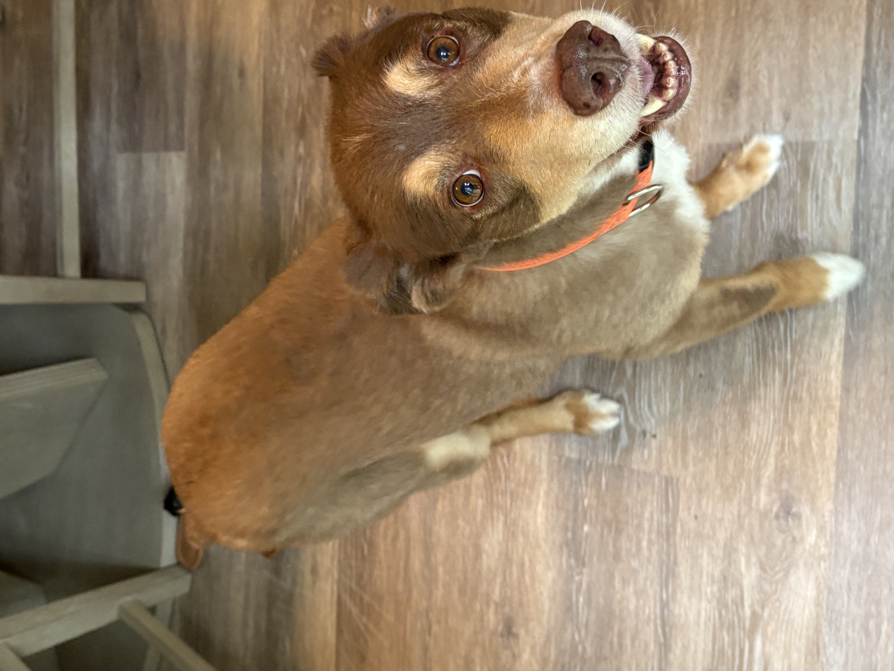

# Homework 1: Tool Setup

Laura Roman-Gonzalez  
CS 625, Fall 2025  
Due: September 7, 2025

## Git, GitHub

### Q1 - URL of GitHub Repo
The URL for the GitHub Repo is: https://github.com/LauraRomanGonzalez/CS625-Project-Files/tree/main.  
In this URL one should be able to find at least three different files, two of them were new create files (Test and Project) and an uploaded file (LCRG HW1-report.md).

### Q2 - Pull Command

Pull command gets the files from GitHub and can send it tothe local computer, and viceversa.

### Q3 - Local Commits

If the change is not seen in GitHub there could be potentially one of the three steps that could have been forgotte, either in the add (where the file is staged), in the commit step or in the push. If one is sure of the first two, most likely during the push step it may have not been properly completed.

## Markdown

### Q1 - Bulleted List

-Blue  
-Yellow  
-Red  

*The difference between bullet list in comparison to number list is one contains numbers; meanwhile, bullet will only contain a symbol. Therefore, with the numbered list, there could be a priority but that may not be the case for the bullet list.  

### Q2 - Markdown Paragraph

The next step is for me to add a picture of my dog **Sammy**. He is an *Australian sheperd*. He is 8 years old, and red merle. He travel from Mississipi to ***Virgina*** with me when he was adopted.

[I'm an inline-style link]([https://www.akc.org/dog-breeds/australian-shepherd/])

I will use an 'git pull' to pull the updated files with Sammy's picture back to my local drive.

### Q3 - Animal Image

# My Dog
Picture of my dog Sammy:

## Tableau

### Q1 - Region Other Than the South

Insert your answer and explanation here

## Google Colab

### Q1 - URL of Google Colab Notebook

Insert your answer and explanation here

## Python/Seaborn

### Q1 - First Penguin Image

Insert your answer and explanation here

### Q2 - Second Penguin Image

Insert your answer and explanation here

### Q3 - Outer Parenthesis

Insert your answer and explanation here

## Observable and Vega-Lite

### Q1 - markCircle to markSquare

Insert your answer and explanation here

### Q2 - markCircle to markPoint

Insert your answer and explanation here

### Q3 - Swap X and Y Axes on Scatterplot

Insert your answer and explanation here

### Q4 - Remove fieldN(Origin)

Insert your answer and explanation here

## References

*Eavery report must include a References section that lists the webpages and URLs that you consulted while completing the assignment. Replace the items below with the references you consulted - these are just examples.* ***Everyone will use some reference to complete these assignments (even I would). You will lose points on your assignment if you do not include the references you used.***

*Markdown Section:
-https://github.com/adam-p/markdown-here/wiki/Markdown-Cheatsheet#links  
-https://docs.github.com/en/get-started/writing-on-github/getting-started-with-writing-and-formatting-on-github/basic-writing-and-formatting-syntax  
